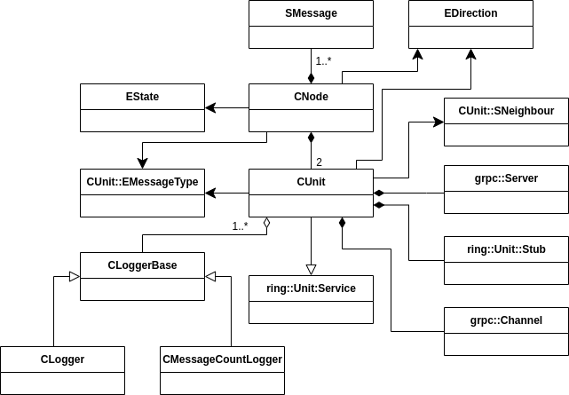
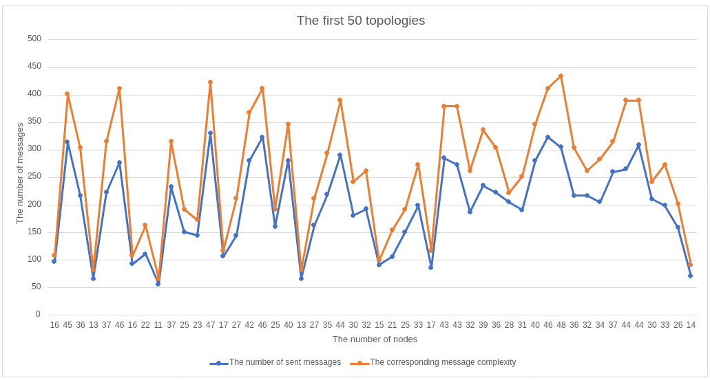
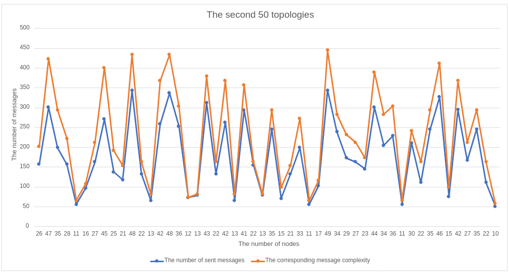

## Leader Election Problem
A central controller is often required to coordinate the executions of a protocol in many distributed computations. The problem of choosing such a central authority from a population of autonomous equivalent computing nodes is known as the Leader Election(LE) problem. There are usually 3 different states of a node: Candidate, Defeated, and Leader. In the end, in the final configuration, there will be only one node with Leader state. All others will be with Defeated state. The Leader Election problem is deterministically solvable in a distributed computing system under Bidirectional(full-duplex) links, Connectivity, Total Reliability, Unique Intitiator assumptions.

## Half-duplex Alternating Eager algorithm
For this algorithm, all nodes must share the same notion about the right and left. Contrary to full-duplex algorithms, a node only sends messages in one direction at a time. Then in the opposite direction. Contrary to the full-duplex algorithm, here a phase means a right and a left message sender. We call a right or left message sending, a half phrase, a step. By doing so, the number of nodes with candidate status is reduced step by step. The message complexity of one step is clearly n. The message complexity of the whole algorithm(with includes the leader notification messages) equals 1.44 * n * log<sub>2</sub>n + O(n).

Initially, the nodes send their own id in a given direction (right by default). If the received id from its neighbor is smaller than its own id, the node's state will switch to defeated. If the received id from the node's neighbor is greater than the id of the node, it remains in the candidate state. After this, the given node, if it is a candidate, sends the id in the opposite direction to the direction of the previous step. Otherwise, it forwards only received messages in the opposite direction. These steps are repeated until a node receives a message containing its ID. This means that all other nodes are in the defeated state. In this case, the remaining candidate node has the leader state and sends out the leader notify message, thereby terminating the algorithm.

## The description of the implementation
The CNode class implements a node behavior in the algorithm.
This class has a shared message queue in which the received messages are stored from the right and left units. This class defines the sending messages and performs the state changes. The unit interface in grpc ring package and grpc communication is implemented by CUnit. It listens on a specified IP address and port and sends messages on another specified IP address and port to its neighbour. A CUnit class implements one direction of communication/transport. Therefore, a CNode object uses two CUnit objects, one for the right and one for the left directions. From the point of view of thread handling, the CNode object runs on one thread(main/queue thread), which creates a new thread for every message for sending. The corresponding right and left CUnit objects listen on specific ports on different threads. These classes take a CLoggerBase type class as our constructor parameter, with which they communicate before sending a message and after receiving a message. CLoggerBase has two different types of derivatives. CLogger logs messages to the file, using the `<Node ID, Time, Sender ID, Receiver ID>` form. The CMessageCountLogger, which counts the sent messages and writes the result to the standard output for later use.



## The compilation and running of the program
In the build directory you can create the corresponding make file for compilation:
```
cmake ..
```
The compilation of the program is with make:
```
make ring
```
The program has some mandatory command line arguments:
- logger type
- input type
Running the program:
```
./ring [message_logger/message_count] [from_file/commnad_line] filename/topology
```
The program uses lots of file descriptors. Therefore, the increasing of the soft limit might be necessary for running the program with large number of nodes:
```
ulimit -n 2048
```

## The analysation of the result
The analyzed data is generated from the received topologies. It can be seen on the diagrams that the message complexity is not greater in any case than the specified upper bound. You can find the more specified result in the `result.txt`.



